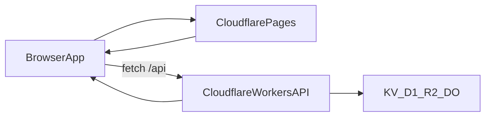

# 01｜Pages + Workers 架構全覽

> 這章用前端工程師最常見的產品型態，說明 Pages 與 Workers 在整體架構中的角色分工。

## 學習目標

- 了解 Pages 與 Workers 的定位差異與互補關係。
- 能選擇「Pages Functions」或「獨立 Workers」作為後端入口。
- 看懂一次請求在 Cloudflare Edge 的完整流向。

## 前置條件

- 已完成 `00` 章的環境準備。
- 知道前端 SPA/SSR 基本概念與 HTTP API 呼叫流程。

## 服務定位：你該把什麼放在哪裡

- **Cloudflare Pages**
  - 適合：前端靜態資產（HTML/CSS/JS）與 Git 驅動的部署流程。
  - 特點：每個分支可有 Preview，適合前端迭代。
- **Cloudflare Workers**
  - 適合：API、驗證、邊緣邏輯、資料存取聚合層。
  - 特點：在邊緣節點執行，延遲低、擴展快。

## 常見組合方式

### 模式 A：Pages + 獨立 Workers（課程主線）

- 前端部署在 Pages。
- API 由獨立 Workers 提供（例如 `api.example.com`）。
- 優點：責任清楚、可獨立版本化、適合中大型團隊。

### 模式 B：Pages + Pages Functions

- API 與前端同一個 Pages 專案中管理。
- 優點：專案整合度高、初期開發快。
- 注意：當 API 規模變大，可能仍會拆成獨立 Workers。

## 一次請求如何流動



## 架構選擇建議（前端視角）

1. **先決定是否有獨立 API 團隊**
   - 有：優先獨立 Workers。
   - 沒有：可先用 Pages Functions，後續再拆分。
2. **再看版本管理方式**
   - 前後端要各自 release：獨立 Workers 更合適。
   - 同步上線需求高：可先整合在 Pages 專案。
3. **最後看風險控制**
   - 分離部署可降低一次變更多系統的風險。

## 最小可行範例（前端呼叫 Workers）

```js
export async function getProfile() {
  const res = await fetch("https://api.example.com/profile", {
    headers: { Accept: "application/json" },
  });

  if (!res.ok) {
    throw new Error(`API failed: ${res.status}`);
  }

  return res.json();
}
```

## 常見錯誤與排查

- **把 API 也當成前端資產部署**：靜態資產與動態邏輯要分開思考。
- **CORS 沒設定**：本地與 Preview 環境 domain 常不同，需列入允許清單。
- **前後端版本耦合太緊**：建議 API 採版本路徑（例如 `/v1`）。

## 章末練習

- 必做：畫出你現在專案的「前端 -> API -> 儲存」三層圖。
- 必做：決定你的第一版採用模式 A 或模式 B，並寫下原因。
- 選做：列出你預計的 API domain 命名規則（prod/staging/dev）。

## 章節重點回顧

- Pages 管前端交付，Workers 管動態邏輯。
- 一開始就明確分工，可降低後續重構成本。
- 本課程主線採「Pages + 獨立 Workers」來練習實務流程。
