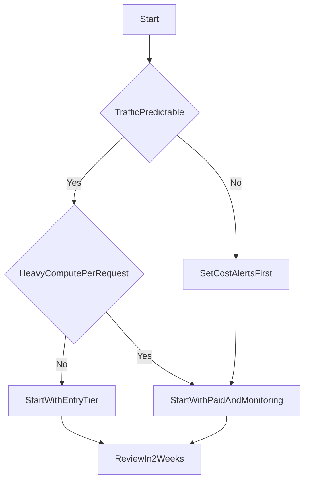

# 02｜Workers 方案選型

> 這章不背規格，而是教你用「流量型態 + 計算特性 + 成本上限」做可落地的方案決策。

## 學習目標

- 了解 Workers 方案選擇時真正重要的判斷維度。
- 能依據產品流量與工作負載挑選合適方案。
- 能建立一套可隨產品成長而調整的升級策略。

## 前置條件

- 已完成 `01` 章，理解 Pages 與 Workers 的分工。
- 對自己產品的流量特性有初步認知（峰值、日活、請求類型）。

## 先有觀念：不要先問「最便宜」，先問「最適配」

選型建議依序看這四件事：

1. **流量型態**
   - 穩定小流量？還是有明顯尖峰？
2. **每次請求的計算成本**
   - 輕量轉發、驗證、快取命中，通常成本低。
   - 需要大量計算或聚合，成本較高。
3. **SLO/穩定性要求**
   - 是否有明確可用性與延遲要求？
4. **團隊可控成本**
   - 月成本上限是否固定？是否需要預估與告警？

## 方案比較（觀念版）

> 具體價格與配額會更新，請以官方定價頁為準。這裡提供的是決策框架，不是死表格。

| 適用情境 | 建議起手 |
|---|---|
| 個人專案、學習、低流量 API | 從免費可用層開始，先驗證架構 |
| 正式產品、穩定商業流量 | 進入付費方案，建立監控與成本告警 |
| 高計算密度、批次或長流程 | 評估是否拆分為隊列/背景作業或搭配其他服務 |

## 決策流程（可直接套用）

## 前端工程師常用判斷法（實務）

- **若 API 大多是 CRUD + 驗證 + 輕量查詢**
  - 先採入門方案，重點放在快取與資料模型。
- **若 API 會做重計算**
  - 優先拆為非同步流程（Queues）或預計算，避免每請求都重算。
- **若需求不確定**
  - 先上線觀測，再依據真實流量調整，避免過早優化。

## 選型前要蒐集的最小資料

- 每日請求量（平均/峰值）
- 單請求平均耗時（毫秒）
- 主要請求類型比例（讀取、寫入、聚合）
- 可接受月成本上限

## 章末輸出物（你要交付的決策單）

請產出 1 頁文件，至少包含：

- 你的預估流量區間
- 當前選擇的方案與原因
- 升級觸發條件（例如：延遲超過目標、成本超標、峰值增加）
- 2 週後回顧指標（P95 latency、error rate、月花費趨勢）

## 常見錯誤與排查

- **只看請求數不看計算量**：高計算 API 容易讓成本與延遲失真。
- **沒有回顧節點**：選型不是一次性決定，需迭代。
- **把本地測試當真實負載**：本地結果不等於線上使用行為。

## 章節重點回顧

- 方案選型是持續迭代，不是一次下注。
- 對前端團隊來說，先上線、可觀測、可調整，比一次選到「完美方案」更重要。
- 下章會接著解決資料儲存如何選，補齊後端能力核心。
