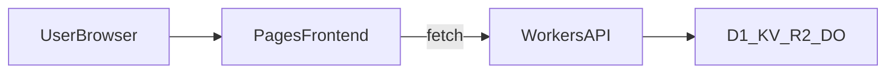

# 06｜前端串接 Workers API

> 這章會把「前端 Pages」與「Workers API」完整接起來，重點是可維護的 API client、穩定 CORS、與一致的錯誤處理模型。

## 學習目標

- 能在前端專案中穩定呼叫 Workers API。
- 能正確處理 CORS、preflight、授權 header 與錯誤格式。
- 能依環境（local/preview/prod）切換 API base URL。

## 前置條件

- 前端已部署到 Pages（至少可本地啟動）。
- Workers API 已有可回應路由（例如 `/api/health`）。
- 了解 `fetch`、HTTP status、JSON 格式。

## 成功標準

1. 前端可以成功呼叫 Workers 並渲染資料。
2. API 失敗時可以顯示可讀錯誤訊息，不會只看到 `Network Error`。
3. Preview 與 Production 可用不同 API URL。

## 架構建議（前端視角）



## 核心觀念

- **API 呼叫要集中**
  - 建立 `apiClient` 模組，避免元件內四散 `fetch`。
- **錯誤格式要一致**
  - 建議 API 錯誤回傳 `{ code, message, details }`。
- **CORS 必須白名單化**
  - 不要直接 `*`，尤其是含認證資訊的 API。

## 步驟 1：前端建立可重用 API client

### 建議檔案結構

```text
src/
  api/
    client.js
    types.js
    profile.js
```

### `src/api/types.js`

```js
export class ApiError extends Error {
  constructor(status, code, message, details) {
    super(message);
    this.name = "ApiError";
    this.status = status;
    this.code = code;
    this.details = details;
  }
}
```

### `src/api/client.js`

```js
import { ApiError } from "./types";

const API_BASE_URL = import.meta.env.VITE_API_BASE_URL;

function buildUrl(path) {
  return `${API_BASE_URL}${path}`;
}

async function parseError(res) {
  let payload = {};
  try {
    payload = await res.json();
  } catch {
    // ignore json parse failure and fallback below
  }

  throw new ApiError(
    res.status,
    payload.code ?? "UNKNOWN_ERROR",
    payload.message ?? `Request failed with status ${res.status}`,
    payload.details
  );
}

export async function apiGet(path, token) {
  const res = await fetch(buildUrl(path), {
    method: "GET",
    headers: {
      Accept: "application/json",
      ...(token ? { Authorization: `Bearer ${token}` } : {}),
    },
  });

  if (!res.ok) await parseError(res);
  return await res.json();
}

export async function apiPost(path, body, token) {
  const res = await fetch(buildUrl(path), {
    method: "POST",
    headers: {
      "Content-Type": "application/json",
      Accept: "application/json",
      ...(token ? { Authorization: `Bearer ${token}` } : {}),
    },
    body: JSON.stringify(body),
  });

  if (!res.ok) await parseError(res);
  return await res.json();
}
```

## 步驟 2：Workers 端補齊 CORS 與錯誤回應

```js
const ALLOWED_ORIGINS = new Set([
  "http://localhost:5173",
  "https://your-pages-project.pages.dev",
  "https://app.example.com",
]);

function corsHeaders(origin) {
  const allowOrigin =
    origin && ALLOWED_ORIGINS.has(origin) ? origin : "https://app.example.com";

  return {
    "Access-Control-Allow-Origin": allowOrigin,
    "Access-Control-Allow-Methods": "GET,POST,OPTIONS",
    "Access-Control-Allow-Headers": "Content-Type,Authorization",
    "Access-Control-Max-Age": "86400",
    Vary: "Origin",
  };
}

function json(data, status = 200, origin = null) {
  return new Response(JSON.stringify(data), {
    status,
    headers: {
      "Content-Type": "application/json",
      ...corsHeaders(origin),
    },
  });
}

export default {
  async fetch(req) {
    const origin = req.headers.get("Origin");
    const { pathname } = new URL(req.url);

    if (req.method === "OPTIONS") {
      return new Response(null, { status: 204, headers: corsHeaders(origin) });
    }

    if (pathname === "/api/health") {
      return json({ ok: true }, 200, origin);
    }

    return json(
      { code: "NOT_FOUND", message: "Route not found" },
      404,
      origin
    );
  },
};
```

## 步驟 3：環境變數與 URL 切換

### 前端 `.env` 建議

```bash
# .env.local
VITE_API_BASE_URL=http://127.0.0.1:8787

# .env.preview
VITE_API_BASE_URL=https://api-staging.example.com

# .env.production
VITE_API_BASE_URL=https://api.example.com
```

### 重要原則

- 不要在程式碼中硬寫 domain。
- Preview 與 Production 必須分離，避免串錯資料環境。

## 步驟 4：在元件中使用 API client

```js
import { useEffect, useState } from "react";
import { apiGet } from "../api/client";

export function ProfilePanel() {
  const [profile, setProfile] = useState(null);
  const [error, setError] = useState(null);

  useEffect(() => {
    apiGet("/api/profile")
      .then(setProfile)
      .catch((e) => setError(e.message));
  }, []);

  if (error) return <p>載入失敗：{error}</p>;
  if (!profile) return <p>載入中...</p>;
  return <p>Hi, {profile.name}</p>;
}
```

## 常見錯誤與排查

- **CORS blocked**
  - 檢查是否有處理 `OPTIONS`、`Access-Control-Allow-Origin` 是否命中。
- **本地可用，Preview 不可用**
  - 通常是 `VITE_API_BASE_URL` 沒分環境，或 origin 白名單少了 preview domain。
- **前端只有 `TypeError: Failed to fetch`**
  - 通常是 network/cors 層錯誤，先看瀏覽器 network 與 workers log。
- **API 錯誤格式不一致**
  - 統一錯誤 payload，前端才有辦法可靠顯示與追蹤。

## 章末練習

- 必做：將現有專案的 `fetch` 集中到 `apiClient`。
- 必做：實作一個有成功與失敗處理的資料讀取元件。
- 選做：加上 request timeout 與可重試策略（僅 GET）。

## 章節重點回顧

- 串接不只是「打到 API」，而是建立可長期維護的呼叫層。
- CORS、錯誤格式、環境切換是最常見的三大故障點。
- 先把 API client 打好，後續接 TanStack Query 也會更順。
