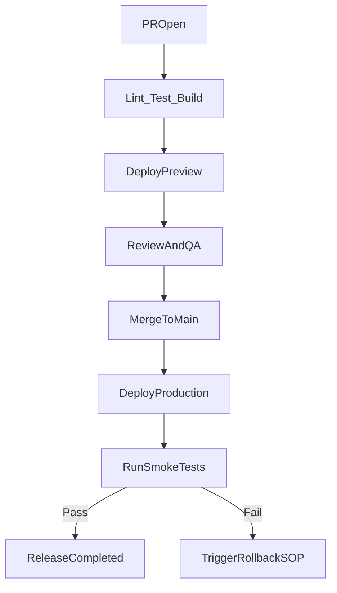

# 08｜CI/CD 流程設計（Pages + Workers）

> 這章把前端團隊最需要的自動化流程建起來：PR 自動驗證、合併自動部署、失敗可快速回滾。

## 學習目標

- 能設計適用於 Pages + Workers 的 CI/CD 流程。
- 能把 lint/test/build/deploy 串成可重現 pipeline。
- 能建立 secrets 管理、部署後驗證與失敗處理機制。

## 前置條件

- 已完成 `04`~`07`，前端與 Workers 均可手動部署。
- 使用 GitHub Actions 或 GitLab CI（本章以 GitHub Actions 示範）。

## 成功標準

1. PR 建立時會自動跑品質檢查（lint/test/build）。
2. 合併到 `main` 後會自動部署 Pages 與 Workers。
3. 部署後會跑 smoke test，失敗會立即通知。

## CI/CD 全流程圖



## Pipeline 分層設計

### 1) Quality 層（每個 PR 必跑）

- ESLint
- JavaScript 風格與品質檢查
- Unit tests
- Frontend build
- Worker build

### 2) Deploy 層（依分支觸發）

- PR 或 feature branch：部署 Preview（可選）
- `main`：部署 Production

### 3) Verify 層（部署後）

- `GET /api/health` 檢查
- 核心頁面 smoke test
- 異常時通知 Slack/Email（可選）

## 必備 Secrets（GitHub 範例）

- `CLOUDFLARE_API_TOKEN`
- `CLOUDFLARE_ACCOUNT_ID`
- `CF_PAGES_PROJECT_NAME`

建議再依環境拆分：

- `CLOUDFLARE_API_TOKEN_STAGING`
- `CLOUDFLARE_API_TOKEN_PROD`

## GitHub Actions 範例 1：PR 品質檢查

`.github/workflows/ci.yml`

```yaml
name: CI

on:
  pull_request:
  push:
    branches: [main]

jobs:
  quality:
    runs-on: ubuntu-latest
    steps:
      - uses: actions/checkout@v4
      - uses: actions/setup-node@v4
        with:
          node-version: 20
          cache: npm

      - name: Install dependencies
        run: npm ci

      - name: Lint
        run: npm run lint

      - name: Test
        run: npm run test -- --run

      - name: Build frontend
        run: npm --prefix frontend run build

      - name: Build worker
        run: npm --prefix worker-api run build
```

## GitHub Actions 範例 2：部署 Pages

`.github/workflows/deploy-pages.yml`

```yaml
name: Deploy Pages

on:
  push:
    branches: [main]

jobs:
  deploy:
    runs-on: ubuntu-latest
    steps:
      - uses: actions/checkout@v4
      - uses: actions/setup-node@v4
        with:
          node-version: 20
          cache: npm

      - name: Install
        run: npm ci

      - name: Build frontend
        run: npm --prefix frontend run build

      - name: Deploy to Cloudflare Pages
        run: npx wrangler pages deploy frontend/dist --project-name ${{ secrets.CF_PAGES_PROJECT_NAME }}
        env:
          CLOUDFLARE_API_TOKEN: ${{ secrets.CLOUDFLARE_API_TOKEN }}
          CLOUDFLARE_ACCOUNT_ID: ${{ secrets.CLOUDFLARE_ACCOUNT_ID }}
```

## GitHub Actions 範例 3：部署 Workers

`.github/workflows/deploy-worker.yml`

```yaml
name: Deploy Worker

on:
  push:
    branches: [main]

jobs:
  deploy-worker:
    runs-on: ubuntu-latest
    defaults:
      run:
        working-directory: worker-api
    steps:
      - uses: actions/checkout@v4
      - uses: actions/setup-node@v4
        with:
          node-version: 20
          cache: npm

      - name: Install
        run: npm ci

      - name: Deploy
        run: npx wrangler deploy
        env:
          CLOUDFLARE_API_TOKEN: ${{ secrets.CLOUDFLARE_API_TOKEN }}
          CLOUDFLARE_ACCOUNT_ID: ${{ secrets.CLOUDFLARE_ACCOUNT_ID }}
```

## 部署後驗證（建議加上）

可在 deploy job 後新增：

```bash
curl -f https://api.example.com/api/health
```

若失敗則讓 pipeline 失敗，並觸發你的事故流程（通知 + 回滾）。

## 分支策略建議

- `feature/*`：只跑 CI，不動 production。
- `main`：部署 production。
- `release/*`（可選）：先部署 staging，驗證後再合併 `main`。

## 常見錯誤與排查

- **CI 綠燈但上線壞掉**
  - 代表你只做 build 驗證，沒做部署後 smoke test。
- **Token 權限不足**
  - 檢查 API token scope 與 account/project 綁定。
- **部署互相覆蓋**
  - 需拆分 frontend/worker pipeline 或加上 environment protection。
- **流程太慢**
  - 加 dependency cache、平行 job、只測受影響模組。

## 章末練習

- 必做：建立 `ci.yml`，確保 PR 可自動 lint/test/build。
- 必做：建立 `deploy-pages.yml` 或 `deploy-worker.yml` 至少一條自動部署流程。
- 選做：加入部署後 health check 與失敗通知。

## 章節重點回顧

- CI/CD 不只是自動部署，而是可驗證、可追蹤、可恢復的交付系統。
- 先把最小流程建起來，再逐步加上 preview、通知、保護規則。
- 有了這套基線，`09` 章就能進入監控與成本優化的實戰運營。
